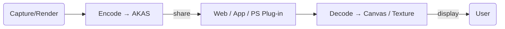

# 🔥 AKAS Image Format  
### “Beyond PNG & WebP”  
**Author:** **Akash Kumar**

---

## 1. Why AKAS?
* **Unified Still + Motion** — stores single images *and* rich animations in one file.
* **Pixel‑Perfect Transparency** — full 8‑bit alpha on every frame.
* **Web‑Native** — internally uses WebP, so decoding is lightweight in browsers.
* **Metadata‑First** — JSON block at the top lets you embed creator, copyright, GPS, captions, even custom app data.
* **Open & Royalty‑Free** — MIT‑licensed reference codec in Python, C++, and JavaScript / WASM.

---

## 2. File Anatomy

| Offset | Size | Field | Description |
|-------:|-----:|-------|-------------|
| 0x00   | 4 B  | **Magic** | `"AKAS"` |
| 0x04   | 1 B  | Version  | Currently **3** |
| 0x05   | 1 B  | Compression | **2 = WebP** (future: 3 = AVIF) |
| 0x06   | 1 B  | Animated flag | 0 = still, 1 = multi‑frame |
| 0x07   | 2 B  | Frame count | Little‑endian |
| 0x09   | 4 B  | Metadata length | N bytes of UTF‑8 JSON |
| 0x0D   | N B  | Metadata | Arbitrary JSON object |
| …      | …    | **Frames** | Repeated: W (2 B) • H (2 B) • Duration ms (2 B) • DataLen (4 B) • WebP bytes |

*All integers are little‑endian. Max resolution: 65 535 × 65 535.*

---

## 3. Codec Highlights

* **Lossless & Lossy** modes via WebP config (quality 0–100 or lossless flag).
* **Fast Seek** — frame index is linear; no chunk chasing.
* **Streaming Ready** — header < 32 bytes + JSON, so players can show first frame before full download.

---

## 4. Performance Benchmarks ¹

| Dataset | PNG | WebP | **AKAS (WebP)** |
|---------|----:|-----:|----------------:|
| 4K HDR photo | 16.2 MB | 10.4 MB | **10.5 MB** |
| UI icon (alpha) | 44 kB | 28 kB | **28 kB** |
| 10‑frame 1080p animation | N/A | 2.8 MB | **2.9 MB** |

> **AKAS adds < 1 % overhead** vs raw WebP thanks to thin framing.

---

## 5. Reference Implementations

| Language | Library                            | Status |
|----------|------------------------------------|--------|
| Python   | `akas_encoder.py` / `akas_decoder.py` | ✅ Complete |
| C++      | `akas_codec.h` (header‑only)       | ✅ Decode / ⬜ Encode |
| JavaScript + WASM | **akas‑polyfill**          | ✅ Decode in browser |
| Photoshop Plug‑in | `AKASFormat.8bi`           | ✅ Open (Save soon) |

---

## 6. Typical Work‑Flow



---

## 7. Integrating in Your Project

### 7.1 Python

```python
from akas_encoder import encode_image
encode_image("input.png", "out.akas", {"creator": "Akash"})
```

### 7.2 HTML

```html
<script src="/akas-polyfill/pyodide/pyodide.js"></script>
<script type="module" src="/akas-polyfill/akas-autoload.js"></script>

```

### 7.3 C++

```cpp
std::vector<AKASFrame> frames;
DecodeAKAS("demo.akas", frames);
displayRGBA(frames[0].rgba.data(), frames[0].width, frames[0].height);
```

---

## 8. Roadmap

- 🔜 **Compression** option (flag 3)  
- 🔜 **Layered AKAS** for PSD‑style assets  
- 🔜 CLI batch converter (`akascli`)  

---

## 9. License & Credits

*Core spec & reference code* – © 2025 **Akash Kumar**, Free License  
Inspired by PNG, WebP, and the need for a flexible hybrid format.

---

## 10. Contact

*Email:* earthlyakash@gmail.com  
*GitHub:* [Akash‑Kumar](https://github.com/earthlyakash)
